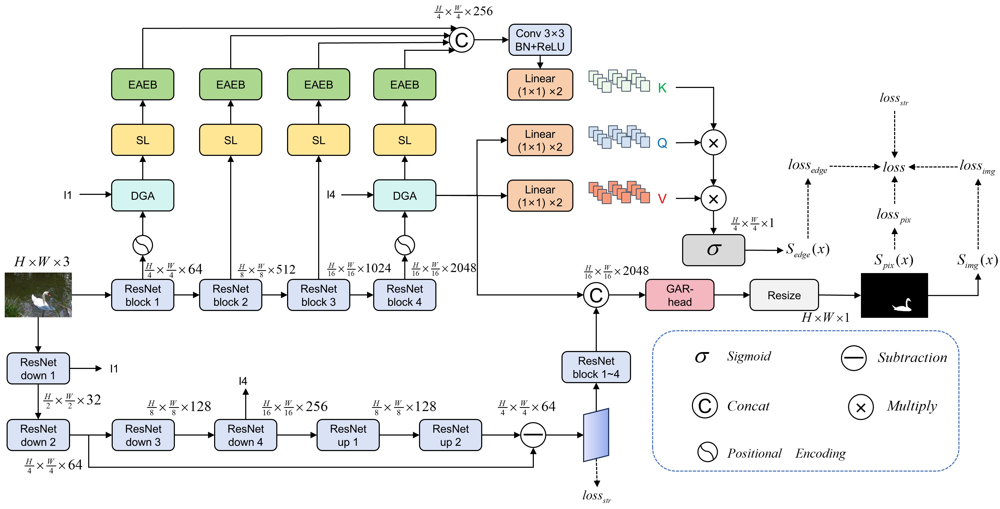

# EGA-Net

EGA-Net is an enhanced gated-attention network for pixel-level image tampering localization.
The model integrates dual-gated feature aggregation, edge-aware enhancement, and global attentive refinement to effectively combine low-level structural cues with high-level semantic information.

---

## Overview

Image tampering localization aims to precisely identify manipulated regions at the pixel level.
However, existing methods often suffer from:
- limited long-range dependency modeling,
- weak boundary sensitivity,
- ineffective cross-scale feature interaction.

To address these issues, EGA-Net introduces:
- Dual-Gated Aggregation (DGA) for cross-scale feature interaction,
- Edge-Aware Enhancement Block (EAEB) for boundary-sensitive feature refinement,
- Global Attentive Refiner (GAR-Head) for global consistency modeling.

---

## Network Architecture



The overall framework follows an encoder–decoder paradigm based on a ResNet backbone, enhanced by gated attention mechanisms and multi-level supervision.

---

## Project Structure

```
EGA-Net/
├─ figures/
│  └─ architecture.jpg
├─ common/
├─ datasets/
├─ datasets_txt/
├─ models/
│  ├─ EGA.py
│  └─ resfcn.py
├─ loss/
├─ train_base.py
├─ train_launch.py
├─ evaluate.py
├─ inference.py
├─ requirements.txt
└─ README.md
```

---

## Environment Setup

Install dependencies:

```
pip install -r requirements.txt
```

Recommended environment:
- Python >= 3.8
- PyTorch >= 1.10
- CUDA >= 11.3 (optional, for GPU acceleration)

---

## Dataset Preparation

Prepare dataset path files in `datasets_txt/`.
Each line should follow the format:

```
image_path mask_path edge_mask_path label
```

Example:

```
/path/to/image.jpg /path/to/mask.png /path/to/edge.png 1
```

Supported datasets:
- CASIA v1 / v2
- COVERAGE
- Columbia
- NIST16
